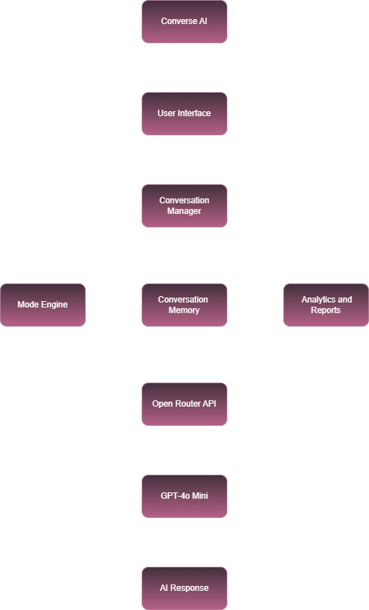
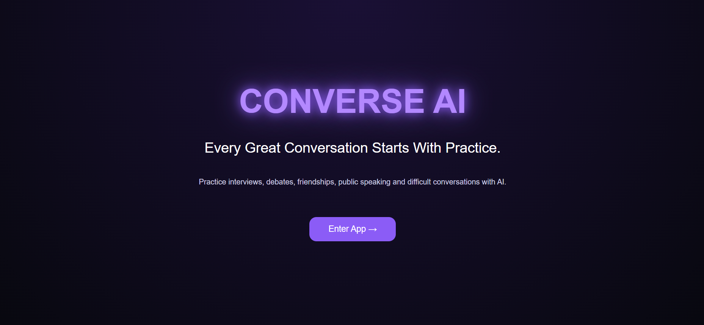
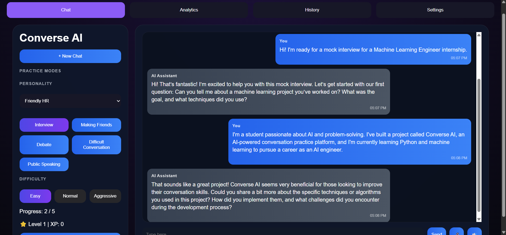
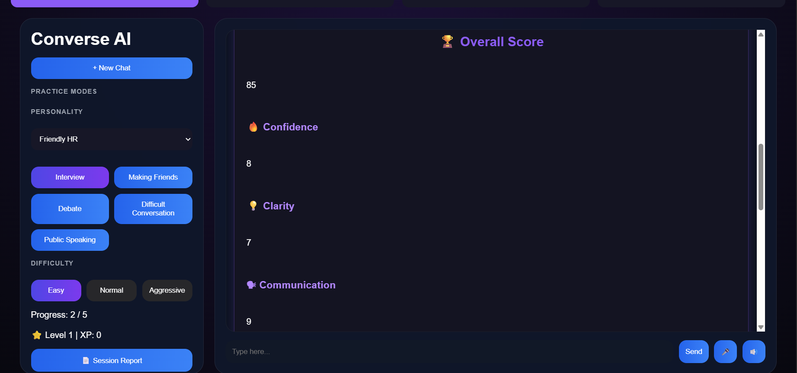
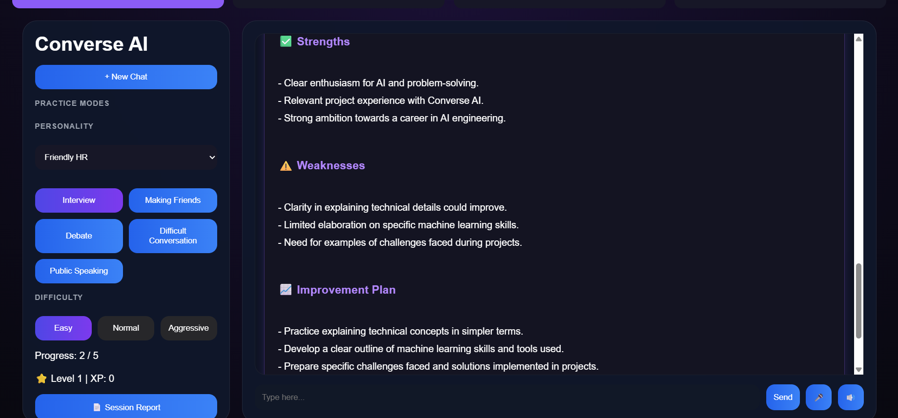
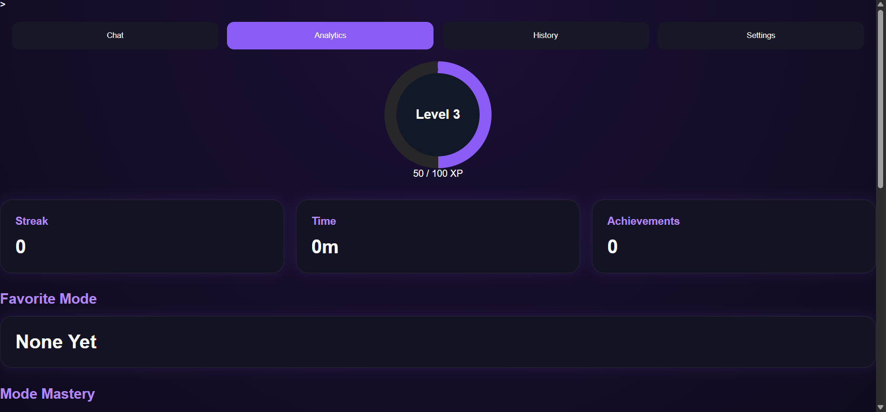
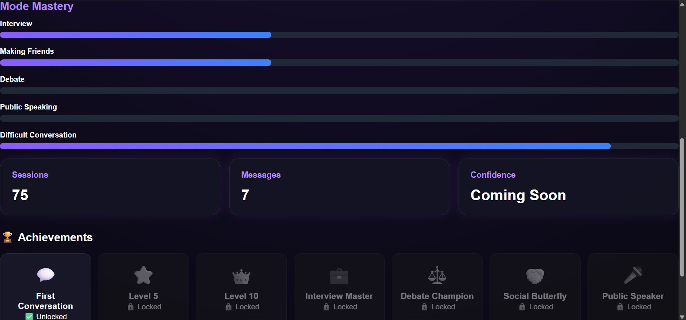

# Converse-AI

# Converse AI - AI Conversation Practice Platform

## Overview

Converse AI is an AI-powered conversation practice platform designed to help users improve their communication skills through realistic, interactive conversations.

The application provides multiple conversation modes, personalized AI responses, conversation history, analytics, and performance reports to help users build confidence in real-world communication.

---

## Features

- Multiple conversation practice modes
- AI-powered conversations
- Conversation history
- Performance analytics
- Session reports
- XP and achievement system
- Personality customization
- Modern responsive interface

---

## Architecture

---

## Tech Stack

- HTML
- CSS
- JavaScript
- OpenRouter API
- GPT-4o Mini
- Vercel

---

## 📸 Screenshots

### Landing Page

### Chat Interface

### AI Session Report

### Analytics Dashboard

## How it Works

1. User selects a conversation mode.
2. The Conversation Controller processes the request.
3. The appropriate conversation settings are applied.
4. The request is sent through the OpenRouter API.
5. GPT-4o Mini generates the response.
6. The conversation is stored and analytics are updated.

---

## Future Improvements

- Multi-agent architecture
- Smarter memory
- Personalized coaching
- Speech emotion analysis
- Cloud synchronization

---

## Author

Wynn
